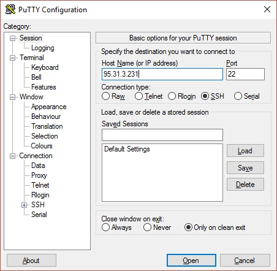
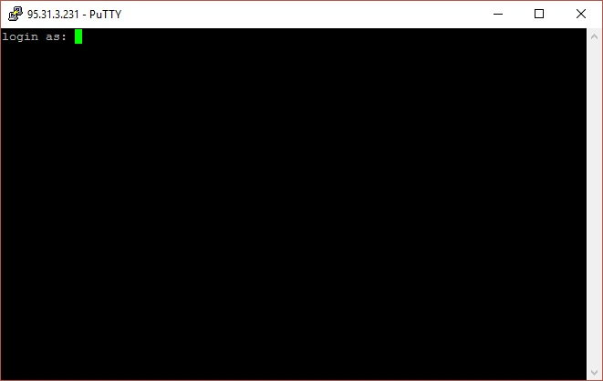
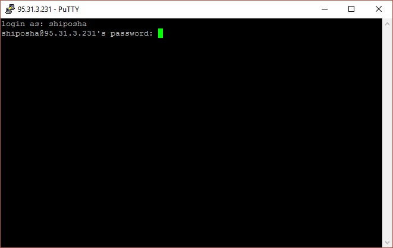
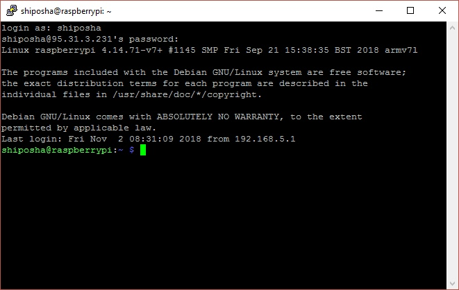

## Куда и как подключаться

IP: 95.31.3.231 открыты порты c 5050 по 5100

### Как подключиться: 
#### Linux/macOS
`ssh user_name@95.31.3.231`

#### Windows
Нужно [скачать PuTTY](https://www.chiark.greenend.org.uk/~sgtatham/putty/latest.html)

Запустить putty.exe

Далее, как на картинках:

**Шаг 1**

**Шаг 2**

**Шаг 3**

**Шаг 4**

Users:
tkachenko, agafonov, alekseevskiy, mayakov, sotnikov, morozov, zabava, monakhov, nesterenko

Default Password:
1234

Команда для смены пароля: passwd    // Сначала надо будет ввести старый пароль  

## Полезные ссылки

- [Копирование файлов через SSH](https://www.shellhacks.com/ru/copy-files-ssh-10-examples/)

- [Знакомство с NodeJS](https://proglib.io/p/beginners-guide-to-node-js/)

- [Сайт ИУ6, файлы для хакатона](http://e-learning.bmstu.ru/moodle/course/view.php?id=122)

## Пример клиент-сервера с Rapberry

1. Поставьте себе все nodeJS
2. Распакуйте [example-client.zip](https://github.com/Ownhack/Ownhack.github.io/blob/master/assets/example-client.zip?raw=true)
3. Выполните в распакованной папке npm install и npm start
4. На localhost:5055 попробуйте потыкать интерфейс

